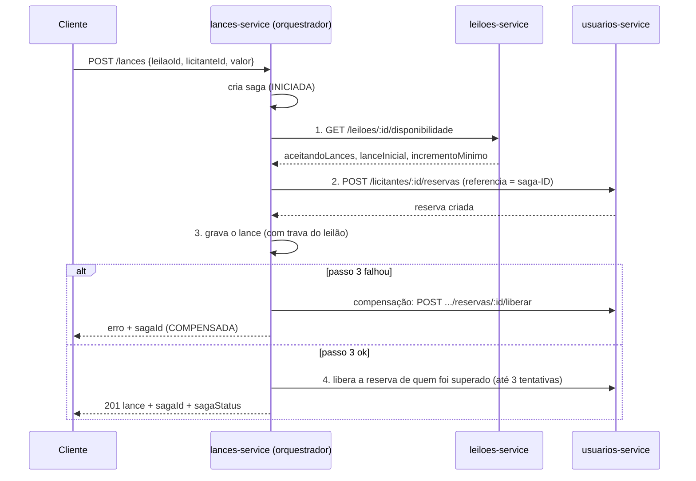

# Arquitetura do Sistema de Leilão de Bois — explicada do zero

> Este guia foi escrito para quem **está começando a programar**. Ele explica o
> que cada peça do sistema faz, por que ela existe e como as peças conversam.
> Para comandos de instalação e exemplos de uso, veja o [`README.md`](../README.md).
> O código também está comentado linha a linha nos trechos importantes.

## Sumário

1. [Visão geral: o que o sistema faz](#1-visão-geral-o-que-o-sistema-faz)
2. [As peças do sistema](#2-as-peças-do-sistema)
3. [O caminho de uma requisição](#3-o-caminho-de-uma-requisição)
4. [As camadas dentro de cada serviço](#4-as-camadas-dentro-de-cada-serviço)
5. [Autenticação com JWT e Kong](#5-autenticação-com-jwt-e-kong)
6. [Comunicação entre os serviços](#6-comunicação-entre-os-serviços)
7. [A Saga de registro de lance](#7-a-saga-de-registro-de-lance)
8. [Regras de negócio e onde estão no código](#8-regras-de-negócio-e-onde-estão-no-código)
9. [Testes automatizados](#9-testes-automatizados)
10. [Pontos de atenção e próximos passos](#10-pontos-de-atenção-e-próximos-passos)
11. [Glossário](#11-glossário)
12. [Roteiro sugerido para a apresentação](#12-roteiro-sugerido-para-a-apresentação)
13. [Mapa de endpoints](#13-mapa-de-endpoints)

---

## 1. Visão geral: o que o sistema faz

É uma **API** (um programa que recebe pedidos pela internet e responde com
dados) para leilões de gado:

- **Leiloeiros** cadastram **leilões** (um lote de bois, com lance inicial,
  incremento mínimo e horário).
- **Licitantes** (compradores) dão **lances**, limitados ao seu **crédito**.
- Todo mundo precisa **se registrar e fazer login** para usar o sistema.

### Analogia: um shopping

Pense no sistema como um shopping:

| No shopping | No sistema |
|---|---|
| A **portaria** confere o crachá de quem entra | O **Kong** confere o token JWT |
| O **balcão de crachás** emite os crachás | O **auth-service** faz login e emite o token |
| Cada **loja** cuida do seu próprio negócio e tem seu próprio estoque | Cada **microsserviço** tem suas regras e **seu próprio banco de dados** |
| Uma loja liga para outra pelo **telefone interno** | Os serviços se chamam por **HTTP (REST)** na rede interna do Docker |

### Por que "microsserviços"?

Em vez de um único programa grande (um **monólito**), o sistema é dividido em
programas menores e independentes. Cada um:

- pode ser desenvolvido, testado e colocado no ar separadamente;
- tem o **próprio banco de dados** — nenhum serviço lê o banco de outro;
- se comunica com os demais só por **HTTP**.

O preço dessa independência: operações que envolvem vários serviços ficam mais
difíceis (não existe uma transação única entre bancos diferentes). É isso que
a **Saga** (seção 7) resolve.

---

## 2. As peças do sistema

```
                         ┌──────────────┐
    Cliente (Postman,  ─▶│  Kong (8000) │  ← único ponto de entrada
    curl, front-end)     └──────┬───────┘
       ┌────────────────┬───────┴────────┬────────────────┐
    público        exige JWT        exige JWT        exige JWT
    /auth/*      /leiloeiros/*      /leiloes/*       /lances/*
                 /licitantes/*
       ▼                ▼                ▼                ▼
┌──────────────┐ ┌──────────────┐ ┌──────────────┐ ┌──────────────┐
│ auth-service │ │ usuarios-    │ │ leiloes-     │ │ lances-      │
│    :3001     │ │ service:3002 │ │ service:3003 │ │ service:3003 │
└──────┬───────┘ └──────┬───────┘ └──────┬───────┘ └──────┬───────┘
    auth-db        usuarios-db       leiloes-db        lances-db
```

| Peça | Responsabilidade | Onde fica |
|---|---|---|
| **Kong** | API Gateway: recebe tudo, valida o JWT, encaminha e bloqueia rotas internas. | `kong/kong.yml` |
| **auth-service** | Registro, login, hash de senha, emissão do token JWT. | `auth-service/` |
| **usuarios-service** | Leiloeiros, licitantes e **crédito** do licitante (reservas). | `usuarios-service/` |
| **leiloes-service** | Leilão (evento) e seu ciclo de vida `AGENDADO → ABERTO → ENCERRADO`. | `leiloes-service/` |
| **lances-service** | Lances e o **orquestrador da Saga**. | `lances-service/` |
| **4 × PostgreSQL** | Um banco por serviço (*database per service*). | `*/src/db/init.sql` |
| **Docker Compose** | Sobe os 9 containers juntos, com rede e variáveis de ambiente. | `docker-compose.yml` |

Detalhe importante: só o Kong tem porta publicada (`ports:` no
`docker-compose.yml`). Os serviços **não são acessíveis de fora** — isso
garante que ninguém "pule" a validação do token.

---

## 3. O caminho de uma requisição

Exemplo: `GET http://localhost:8000/leiloes/1` com um token válido.

```
1. Cliente ──HTTP──▶ Kong (porta 8000)
2. Kong: o caminho começa com /leiloes → service "leiloes-service"
3. Kong: esse service tem o plugin jwt → confere assinatura e validade do token
         (se falhar, responde 401 e PARA aqui)
4. Kong ──HTTP──▶ leiloes-service:3003/leiloes/1   (rede interna do Docker)
5. app.js         → express.json() e extrairUsuario (lê quem está logado)
6. leilaoRoutes   → "GET /:id" chama leilaoController.buscarPorId
7. controller     → converte o id "1" em número e chama o service
8. leilaoService  → regra: se não existir, lança erro 404
9. repository     → SELECT ... FROM leiloes WHERE id = $1
10. Postgres devolve a linha → sobe pelas camadas → res.json(leilao) → 200 OK
```

Se algo der errado no caminho, o `service` lança um `ErroDeValidacao` com o
código HTTP (400, 404, 409...), o controller repassa o erro com `next(err)` e o
**middleware de erro** (`middlewares/tratarErros.js`) responde em JSON:
`{ "erro": "Leilao nao encontrado." }`. Todo erro da API tem esse formato —
inclusive os gerados pelo Kong (exceto o `401` do plugin JWT).

---

## 4. As camadas dentro de cada serviço

Todos os serviços seguem a mesma organização (**arquitetura em camadas**):

```
routes/  →  controllers/  →  services/  →  repositories/  →  PostgreSQL
                                │
                                └──▶ clients/  ──HTTP──▶ outros serviços
```

| Pasta | O que faz | Analogia |
|---|---|---|
| `server.js` | Liga o servidor numa porta. | Abrir as portas da loja. |
| `app.js` | Monta o Express: middlewares, rotas, 404. | A planta da loja. |
| `routes/` | Liga "método + caminho" a uma função do controller. | A placa indicando cada balcão. |
| `controllers/` | Lê a requisição, chama o service, devolve status HTTP. | O atendente. |
| `services/` | **Regras de negócio**. Não conhece HTTP nem SQL. | O gerente que decide. |
| `repositories/` | O único lugar com **SQL**. | O estoquista. |
| `clients/` | Chamadas HTTP para outros microsserviços. | O telefone interno. |
| `sagas/` | Coordena uma operação entre vários serviços (só no lances). | O coordenador de um evento. |
| `middlewares/` | Funções que rodam antes das rotas (`extrairUsuario`: ler o token) ou depois delas, em caso de erro (`tratarErros`: responder `{ erro }`). | O segurança da porta e o balcão de reclamações. |
| `utils/` | Validações e o tipo `ErroDeValidacao`. | A caixa de ferramentas. |
| `config/db.js` | Conexão (pool) com o Postgres. | A chave do depósito. |
| `db/init.sql` | Criação das tabelas. | A planta do depósito. |
| `db/migrar.js` | Roda o `init.sql` ao subir, com novas tentativas (usuarios, leiloes e lances). | Conferir o depósito ao abrir. |

**Por que separar assim?**

- Cada arquivo tem **uma responsabilidade** — fica fácil achar onde mexer.
- As **regras** (`services/`) podem ser testadas **sem banco e sem rede**,
  trocando `repositories/` e `clients/` por *mocks* (seção 9).
- Trocar o banco ou o formato HTTP afeta só uma camada.

---

## 5. Autenticação com JWT e Kong

### O que é um JWT

Um **JSON Web Token** é um "crachá digital" no formato `xxxxx.yyyyy.zzzzz`:

| Parte | Conteúdo |
|---|---|
| header | algoritmo (`HS256`) |
| payload | dados: `sub` (id do usuário no auth-db), `email`, `papel`, `perfilId` (id do leiloeiro/licitante no usuarios-service), `iss` (emissor), `exp` (validade) |
| assinatura | calculada com um **segredo**; se alguém alterar o payload, ela deixa de bater |

> O payload **não é criptografado**, só codificado — qualquer um consegue ler.
> Por isso nunca se coloca senha dentro do token.

### O fluxo completo

```
1. POST /auth/login {email, senha}
2. auth-service confere a senha com bcrypt (utils/password.js)
3. auth-service gera o token assinado com JWT_SECRET (utils/jwt.js)
4. Cliente guarda o token e envia em toda requisição:
       Authorization: Bearer <token>
5. Kong confere o token usando o MESMO segredo (consumer no kong.yml)
6. Serviço recebe a requisição e apenas DECODIFICA o token
   (middlewares/extrairUsuario.js) para saber quem está logado
7. O service decide se aquele usuário PODE fazer aquilo (autorização)
```

### Autenticação × autorização

- **Autenticação** — "quem é você?": o Kong confere se o token é autêntico.
- **Autorização** — "você **pode** fazer isto?": decidido nos `services/`, usando
  `papel` e `perfilId` do token.

| Ação | Quem pode | Onde no código |
|---|---|---|
| Cadastrar leilão | só `LEILOEIRO`, em nome próprio | `leilaoService.autorizarLeiloeiro` |
| Editar, abrir, encerrar, cancelar, remover leilão | só o **dono** do leilão | `leilaoService.garantirDono` |
| Dar lance | só `LICITANTE`, em nome próprio | `lanceService.autorizarLicitante` |
| Alterar/remover cadastro de leiloeiro ou licitante | só o **próprio** (e o licitante não muda o próprio limite) | `usuarios-service/src/utils/autorizacao.js` |
| Criar perfil (`POST /leiloeiros`, `/licitantes`) | só o auth-service, no registro | Kong bloqueia de fora (403) |

Sem login → `401`; sem permissão → `403`. Assim ninguém cria leilão para outro
leiloeiro, nem dá lance (e gasta o crédito) de outro licitante.

Por que dá para confiar num token só **decodificado**? Porque o Kong já
conferiu a assinatura e os serviços não têm porta exposta — só se chega a eles
pelo Kong ou pela rede interna do Docker.

> `sub` ≠ `perfilId`: o usuário 7 do auth-db pode ser o licitante 3 do
> usuarios-db. As regras de autorização usam o `perfilId`.

Para funcionar, dois valores precisam ser **iguais** em dois lugares:

| Valor | No `docker-compose.yml` | No `kong/kong.yml` |
|---|---|---|
| Emissor | `JWT_ISSUER: sistema-leilao-auth` | `key: sistema-leilao-auth` |
| Segredo | `JWT_SECRET: super-segredo-...` | `secret: super-segredo-...` |

### Senhas

A senha nunca é guardada como foi digitada. O `bcrypt` gera um **hash** (uma
"impressão digital" de mão única, com *salt* aleatório). No login, o bcrypt
calcula o hash da senha digitada e compara com o guardado.

### Rotas internas

`/licitantes/:id/reservas` mexe no crédito e só deve ser chamada pela Saga. O
Kong tem uma rota com expressão regular que responde **403** para quem vem de
fora; a Saga chama o serviço direto pela rede interna, sem passar pelo Kong.

---

## 6. Comunicação entre os serviços

Os serviços conversam por **REST** (HTTP + JSON), direto pela rede do Docker.
O endereço **nunca** fica no código: vem de variável de ambiente.

| Quem chama | Quem é chamado | Para quê | Onde no código |
|---|---|---|---|
| auth-service | usuarios-service `POST /leiloeiros` ou `/licitantes` | criar o perfil no registro (se falhar, o usuário é **apagado**: compensação) | `auth-service/src/services/authService.js` |
| leiloes-service | usuarios-service `GET /leiloeiros/:id` | validar o leiloeiro do leilão | `leiloes-service/src/clients/usuariosClient.js` |
| leiloes-service | usuarios-service `POST /reservas/leilao/:id/liberar` (interna) | devolver o crédito ao **cancelar** o leilão | `leiloes-service/src/clients/usuariosClient.js` |
| lances-service | leiloes-service `GET /leiloes/:id/disponibilidade` | Saga, passo 1 | `lances-service/src/clients/leiloesClient.js` |
| lances-service | usuarios-service `POST /licitantes/:id/reservas` e `.../liberar` | Saga, passos 2 e 4 + compensação | `lances-service/src/clients/usuariosClient.js` |

Todas as chamadas passam por `clients/<servico>Client.js`, apoiado no helper
`clients/http.js` — **o mesmo arquivo** em auth, leiloes e lances. Cuidados que
o código toma:

- **Timeout** (3 s, `SERVICOS_TIMEOUT_MS`): se o outro serviço travar, a chamada
  é cancelada (`AbortController`) em vez de esperar para sempre.
- **URL ausente** (variável de ambiente não configurada) também vira
  `ServicoIndisponivel` — nada é pulado em silêncio.
- **Erro de rede ou 5xx** vira `ServicoIndisponivel`, que é devolvido ao
  cliente como **503**.
- **Erros de negócio (4xx)** são repassados com o mesmo código (ex.: 409
  crédito insuficiente).

---

## 7. A Saga de registro de lance

### O problema

Registrar um lance precisa, ao mesmo tempo:

1. conferir o leilão (banco do **leiloes-service**);
2. reservar o crédito do licitante (banco do **usuarios-service**);
3. gravar o lance (banco do **lances-service**).

Com um banco só, bastaria uma **transação** (`BEGIN` … `COMMIT`): ou tudo
vale, ou nada vale. Com três bancos, isso não existe.

### A solução: Saga orquestrada

Uma **Saga** é uma sequência de transações locais. Se um passo falha, o
orquestrador executa **compensações** — ações que desfazem os passos que já
tinham dado certo. "Orquestrada" significa que existe um coordenador central:
`lances-service/src/sagas/registrarLanceSaga.js`.

| # | Passo | Serviço | Tipo | Se falhar |
|---|---|---|---|---|
| 1 | `consultar-disponibilidade` | leiloes | leitura | recusa o lance; nada a desfazer → `FALHOU` |
| 2 | `reservar-credito` | usuarios | **compensável** | recusa (ex.: 409 sem crédito) → `FALHOU` |
| 3 | `gravar-lance` | lances | **ponto sem volta** | **compensa o passo 2** (libera a reserva) → `COMPENSADA` |
| 4 | `liberar-credito-superado` | usuarios | **repetível** | tenta 3×; senão → `CONCLUIDA_COM_PENDENCIA` (reprocessável) |



### Conceitos que aparecem na Saga

- **Idempotência**: repetir a mesma operação não muda o resultado. A reserva
  usa `saga-<id>` como `referencia` única; se a chamada se repetir, o
  usuarios-service devolve a mesma reserva. Liberar duas vezes também não dá erro.
- **Concorrência** (dois pedidos ao mesmo tempo):
  - no crédito: `SELECT ... FOR UPDATE` trava o licitante durante a reserva;
  - no lance: `pg_advisory_xact_lock` trava o leilão, e o valor é conferido
    **de novo** antes do `INSERT` (outro lance pode ter entrado no meio).
- **Rastreabilidade**: cada passo é anotado na tabela `sagas_lance` (coluna
  `passos`, em JSON). Consulte com `GET /lances/sagas/:id`.
- **Demonstração**: com `SAGA_PERMITIR_FALHA_SIMULADA=true`, o header
  `X-Simular-Falha: gravar-lance` força a falha do passo 3 e mostra a
  compensação acontecendo.

### Status finais

| Status | Significado |
|---|---|
| `CONCLUIDA` | Tudo certo. |
| `CONCLUIDA_COM_PENDENCIA` | Lance gravado, mas a liberação do crédito do superado falhou 3×. Use `POST /lances/sagas/:id/reprocessar`. |
| `FALHOU` | Falhou antes de reservar crédito — nada a desfazer. |
| `COMPENSADA` | Falhou depois da reserva, e a reserva foi devolvida. |
| `FALHOU_COMPENSACAO` | Falhou e até a devolução falhou — exige correção manual. |

---

## 8. Regras de negócio e onde estão no código

### usuarios-service

| Regra | Arquivo |
|---|---|
| Leiloeiro: nome ≥ 3, e-mail válido, registro no formato `ORGAO-NUMERO` | `services/leiloeiroService.js` → `validarDados` |
| Leiloeiro: e-mail e registro profissional únicos (409) | `services/leiloeiroService.js` → `cadastrar` |
| Licitante: CPF válido pelos dígitos verificadores | `utils/validadores.js` → `cpfValido` |
| Licitante: CPF e e-mail únicos; limite de crédito ≥ 0 | `services/licitanteService.js` |
| Crédito: reservas nunca passam do limite; reserva/liberação idempotentes | `services/creditoService.js` |
| Autorização: só o próprio altera/remove o cadastro; licitante não muda o próprio limite | `utils/autorizacao.js` + `atualizar`/`remover` dos services |
| Privacidade (LGPD): dados pessoais só para o próprio; os demais veem os campos públicos | `utils/autorizacao.js` → `visaoPara`; `listar`/`consultar` dos services |

### leiloes-service (`services/leilaoService.js`)

| Regra | Função |
|---|---|
| 1. Título, lote, valores e datas válidos; duração ≥ 30 min | `validarDados` |
| 2. Início no futuro | `validarDataFutura` |
| 3. Leiloeiro existe no usuarios-service | `garantirLeiloeiroExiste` |
| 4. Leiloeiro sem dois leilões ativos no mesmo horário | `garantirAgendaLivre` |
| 5. Ciclo de vida `AGENDADO → ABERTO → ENCERRADO` (+ `CANCELADO`) | `alterarStatus` + `utils/validadores.js` |
| 6. Editar/remover só enquanto `AGENDADO` | `atualizar`, `remover` |
| 7. Autorização: só o leiloeiro logado cadastra; só o dono altera | `autorizarLeiloeiro`, `garantirDono` |
| 8. Cancelar devolve o crédito reservado (REST ao usuarios-service) | `alterarStatus`, `liberarCreditoDoLeilao` |

### lances-service

| Regra | Arquivo |
|---|---|
| 1–2. Ids válidos e valor > 0 | `services/lanceService.js` → `validarDados` |
| 3. Leilão existe e aceita lances | `sagas/registrarLanceSaga.js` (passo 1) |
| 4. 1º lance ≥ lance inicial; depois ≥ maior + incremento | `services/regrasDoLance.js` |
| 5. Não cobrir o próprio lance | `services/regrasDoLance.js` |
| 6. Crédito disponível | Saga passo 2 → usuarios-service |
| 7. Autorização: só o licitante logado, em nome próprio | `services/lanceService.js` → `autorizarLicitante` |

---

## 9. Testes automatizados

- Ferramenta: **Jest**. Cada serviço tem uma pasta `tests/`, com dois tipos de teste:
  - **regras de negócio** (`tests/<service>.test.js`): testam os `services/`
    (e a Saga), onde estão as regras;
  - **camada HTTP** (`tests/rotas.test.js`): com o **supertest**, fazem
    requisições de verdade ao `app` do Express e conferem se cada rota chama o
    controller certo, repassa os dados certos e devolve o status HTTP certo
    (200, 201, 204, 4xx, 500). Aqui os `services/` é que são mockados.
- `repositories/` e `clients/` são trocados por **mocks** (pastas
  `__mocks__/`): funções falsas (`jest.fn()`) que o teste programa para
  devolver o que quiser — por exemplo, "o banco não encontrou nada" ou "o
  usuarios-service está fora do ar". Assim os testes rodam **sem banco e sem rede**.

Estrutura de um teste:

```js
describe('leilaoService.remover', () => {        // grupo
  test('so remove leilao AGENDADO', async () => { // cenário
    leilaoRepository.buscarPorId.mockResolvedValue({ id: 1, status: 'ABERTO', leiloeiro_id: 1 }); // prepara o mock
    await expect(leilaoService.remover(1, leiloeiro1)).rejects.toThrow(/use o cancelamento/);   // verifica
  });
});
```

A **cobertura** é medida sobre **todo o `src/`** (menos os mocks), e o
`coverageThreshold` do `package.json` faz o `npm test` **falhar** se qualquer
métrica ficar abaixo de 50%.

| Serviço | Testes | Cobertura (linhas) |
|---|---|---|
| auth-service | 28 | 82% |
| usuarios-service | 70 | 78% |
| leiloes-service | 62 | 81% |
| lances-service | 57 | 75% |
| **Total** | **217** | |

Como rodar:

| O quê | Comando | Precisa do sistema no ar? |
|---|---|---|
| Unitários dos 4 serviços, com resumo | `powershell -ExecutionPolicy Bypass -File .\testes\testar-unitarios.ps1` | Não (usa Node local ou Docker) |
| Unitários de um serviço | `cd <servico> && npm install && npm test` | Não |
| Ponta a ponta (71 passos pelo Kong) | `powershell -ExecutionPolicy Bypass -File .\testes\testar-tudo.ps1` | Sim |
| Coleção Postman (62 requisições com conferência automática) | no Postman (Runner) ou `docker run --rm -v "${PWD}/testes:/etc/newman" postman/newman:alpine run leilao-microservicos.postman_collection.json --env-var base_url=http://host.docker.internal:8000` | Sim |
| Manual | `testes/roteiro-de-testes.md` (curl, no Git Bash ou Linux) | Sim |

---

## 10. Pontos de atenção e próximos passos

### Já resolvido nesta revisão

- **Registro distribuído com compensação**: antes, se o perfil fosse recusado
  (ex.: CPF inválido), o registro respondia `201` com `perfil: null` e a conta
  ficava inutilizável e com o e-mail preso. Agora o usuário recém-criado é
  apagado e o erro real (`400`/`409`/`503`) volta ao cliente.
- **Admin API do Kong** (porta 8001) publicada só em `127.0.0.1`.
- **Comentários**: um único bloco por função e numeração das regras igual à do README.
- **Código sem uso removido**: `verificarToken`, `usuarioRepository.buscarPorId`
  (auth) e `lanceRepository.criar` (lances).
- **Consistência entre serviços**: arquivos de apoio **idênticos** em todos os
  serviços que os usam — `utils/erros.js`, `config/db.js`, `db/migrar.js` e
  `middlewares/tratarErros.js` (nos 4), `clients/http.js` (auth, leiloes e
  lances) e `middlewares/extrairUsuario.js` (usuarios, leiloes e lances). Os 4
  serviços rodam a migração ao subir e nenhum service lê `process.env`.
- **Chamadas entre serviços padronizadas**: o auth deixou de fazer `fetch`
  direto (agora `clients/usuariosClient.js`, com timeout) e o leiloes deixou de
  repetir a lógica de timeout (usa o `clients/http.js`).
- **Middleware de erro único**: os controllers só fazem `next(err)`; um JSON
  inválido responde `400 { erro }` (antes, uma página HTML). Os erros do Kong
  seguem o mesmo formato (exceto o `401` do JWT).
- **Privacidade (LGPD)**: CPF, e-mail, telefone e limite só para o próprio dono.
- **Autorização**: o token passou a levar `perfilId`; lances só em nome do
  licitante logado; leilões só em nome do leiloeiro logado e alterados só pelo dono.
- **Cadastros de usuários**: `PUT`/`DELETE` de `/leiloeiros` e `/licitantes` só
  pelo próprio dono (`utils/autorizacao.js`); o licitante não altera o próprio
  limite de crédito; `POST` de perfis bloqueado no Kong (só o auth-service cria,
  no registro, pela rede interna).
- **Cancelamento de leilão**: antes, o crédito de quem estava ganhando ficava
  bloqueado para sempre. Agora as reservas guardam o `leilao_id` e o cancelamento
  libera todas elas (Regra 8), com repetição segura se o usuarios-service falhar.
- `package-lock.json` do lances-service versionado; pastas `coverage/` fora do
  git; campo `version:` obsoleto removido do `docker-compose.yml`.

Duplicar esses arquivos de apoio em cada serviço é **intencional**
(independência dos microsserviços: nenhum depende de uma biblioteca comum).

### Próximos passos

- **Papel de administrador**: hoje ninguém altera o limite de crédito depois do
  cadastro (o próprio licitante é barrado de propósito). Um papel `ADMIN`
  permitiria ajustes controlados.
- **Remoção de cadastros em uso**: remover um leiloeiro com leilões ativos, ou
  um licitante com reservas de crédito, ainda é permitido. Uma regra de negócio
  (ou "desativar" em vez de apagar) evitaria dados órfãos entre os serviços.
- **401 do Kong**: o plugin JWT responde `{ "message": ... }`; padronizar para
  `{ "erro": ... }` exigiria um plugin em Lua ou a versão Enterprise.
- **Crédito visível a qualquer logado**: `GET /licitantes/:id/credito` ainda
  mostra limite e reservado de qualquer licitante (o teste ponta a ponta usa
  isso para conferir a Saga); poderia seguir a mesma regra de privacidade.

**Evoluções (do README)**

- Acompanhamento ao vivo dos lances (WebSockets ou eventos).
- Encerramento do pregão como Saga (registrar o vencedor e confirmar o crédito dele).

---

## 11. Glossário

| Termo | Significado |
|---|---|
| **API** | Programa que recebe pedidos e devolve dados, usado por outros programas. |
| **REST** | Estilo de API sobre HTTP: recursos em URLs (`/leiloes/1`) e métodos (`GET`, `POST`...). |
| **HTTP** | Protocolo da web. Um pedido tem método, caminho, headers e corpo. |
| **Métodos HTTP** | `GET` lê, `POST` cria, `PUT` atualiza, `PATCH` altera um pedaço, `DELETE` remove. |
| **Status HTTP** | `200` OK, `201` criado, `204` sem conteúdo, `400` dado inválido, `401` não autenticado, `403` proibido, `404` não encontrado, `409` conflito, `500` erro interno, `503` serviço indisponível. |
| **JSON** | Formato de texto para dados: `{ "nome": "Maria", "idade": 30 }`. |
| **Header** | Metadado de uma requisição (ex.: `Authorization`, `Content-Type`). |
| **Express** | Biblioteca Node.js para criar servidores HTTP. |
| **Middleware** | Função que roda antes da rota e pode ler/alterar a requisição. |
| **async / await** | Forma de esperar operações demoradas (banco, rede) sem travar o programa. |
| **Promise** | Um "vale" de um resultado que chegará no futuro. |
| **Microsserviço** | Programa pequeno e independente, com banco próprio. |
| **API Gateway** | Porta de entrada única que roteia e protege os serviços (aqui, o Kong). |
| **JWT** | Token assinado que prova quem é o usuário. |
| **Hash / bcrypt** | Transformação de mão única usada para guardar senhas. |
| **SQL** | Linguagem para consultar e alterar bancos relacionais. |
| **SQL injection** | Ataque que insere SQL malicioso num campo; evitado com parâmetros `$1`. |
| **Transação** | Grupo de comandos SQL que vale por inteiro ou não vale (`BEGIN`/`COMMIT`/`ROLLBACK`). |
| **Lock / trava** | Impede que duas operações mexam no mesmo dado ao mesmo tempo. |
| **Saga** | Sequência de transações locais com compensações, para operações entre serviços. |
| **Compensação** | Ação que desfaz um passo anterior da Saga. |
| **Idempotência** | Repetir a operação não muda o resultado. |
| **Mock** | Versão falsa de um módulo, usada em testes. |
| **Container / Docker** | Caixa isolada com um programa e tudo de que ele precisa. |
| **Docker Compose** | Arquivo que sobe vários containers juntos. |
| **Variável de ambiente** | Configuração passada de fora para o programa (`process.env.NOME`). |

---

## 12. Roteiro sugerido para a apresentação

> O roteiro **por aluno** (15 minutos, com demos prontas em PowerShell) está em
> [`APRESENTACAO.md`](APRESENTACAO.md). Abaixo, a ordem temática para estudo.

1. **Visão geral** — o desenho da seção 2 e a analogia do shopping.
2. **`docker-compose.yml`** — os 9 containers, um banco por serviço, só o Kong com porta.
3. **`kong/kong.yml`** — rotas, plugin JWT e o bloqueio 403 das reservas.
4. **Um serviço por dentro** (leiloes-service), seguindo uma requisição:
   `app.js` → `routes/leilaoRoutes.js` → `controllers/leilaoController.js` →
   `services/leilaoService.js` → `repositories/leilaoRepository.js`.
5. **Autenticação** — `auth-service/src/services/authService.js`, `utils/jwt.js`, `utils/password.js`.
6. **A Saga** — `lances-service/src/sagas/registrarLanceSaga.js` (o cabeçalho
   resume tudo) + demonstração com `X-Simular-Falha: gravar-lance` e
   `GET /lances/sagas/:id`.
7. **Autorização** — seção 5: `lanceService.autorizarLicitante` e
   `leilaoService.garantirDono`; demonstrar um leiloeiro tentando dar lance (403).
8. **Testes** — `testar-unitarios.ps1` (217 testes, cobertura ≥ 50% em todo o `src/`) e `testar-tudo.ps1` (71 passos).
9. **Próximos passos** — seção 10.

---

## 13. Mapa de endpoints

Tudo passa pelo Kong em `http://localhost:8000`. Com exceção de `/auth/*`, as
rotas exigem `Authorization: Bearer <token>` (sem token → `401`, respondido pelo
próprio Kong). "Interna" = chamada só entre serviços, pela rede do Docker; de
fora, o Kong responde `403`.

### auth-service (`/auth`, público)

| Método | Rota | Descrição |
|---|---|---|
| `POST` | `/auth/registrar` | Cria usuário + perfil (leiloeiro ou licitante) e devolve o token. |
| `POST` | `/auth/login` | Confere e-mail e senha e devolve o token. |
| `GET` | `/auth/health` | Healthcheck. |

### usuarios-service (`/leiloeiros`, `/licitantes`)

| Método | Rota | Quem pode | Descrição |
|---|---|---|---|
| `GET` | `/leiloeiros`, `/leiloeiros/:id` | logado | Lista / detalha leiloeiros (e-mail e telefone só para o próprio). |
| `POST` | `/leiloeiros` | **interna** | Cria o perfil (auth-service, no registro). |
| `PUT` / `DELETE` | `/leiloeiros/:id` | o próprio | Atualiza (nome, telefone) / remove o cadastro. |
| `GET` | `/licitantes`, `/licitantes/:id` | logado | Lista / detalha licitantes (CPF, e-mail, telefone e limite só para o próprio). |
| `POST` | `/licitantes` | **interna** | Cria o perfil (auth-service, no registro). |
| `PUT` / `DELETE` | `/licitantes/:id` | o próprio | Atualiza (nome, telefone; não o limite) / remove. |
| `GET` | `/licitantes/:id/credito` | logado | Limite, reservado e disponível. |
| `GET` | `/licitantes/:id/reservas` | logado | Histórico de reservas. |
| `POST` | `/licitantes/:id/reservas` | **interna** | Reserva crédito (Saga, passo 2). |
| `POST` | `/licitantes/:id/reservas/:reservaId/liberar` | **interna** | Libera a reserva (compensação / passo 4). |
| `POST` | `/reservas/leilao/:leilaoId/liberar` | **interna** | Libera todas as reservas de um leilão cancelado (o Kong nem tem essa rota). |

### leiloes-service (`/leiloes`)

| Método | Rota | Quem pode | Descrição |
|---|---|---|---|
| `GET` | `/leiloes` | logado | Lista. Filtros opcionais: `?status=ABERTO`, `?leiloeiroId=1`. |
| `GET` | `/leiloes/:id` | logado | Detalha um leilão. |
| `GET` | `/leiloes/:id/disponibilidade` | logado / interna | Se aceita lances agora (Saga, passo 1). |
| `POST` | `/leiloes` | leiloeiro | Cadastra em nome do leiloeiro logado. |
| `PUT` | `/leiloes/:id` | o dono | Edita um leilão ainda `AGENDADO`. |
| `PATCH` | `/leiloes/:id/abrir` | o dono | `AGENDADO → ABERTO`. |
| `PATCH` | `/leiloes/:id/encerrar` | o dono | `ABERTO → ENCERRADO`. |
| `PATCH` | `/leiloes/:id/cancelar` | o dono | Cancela um leilão não encerrado **e devolve o crédito reservado** (repetir tenta liberar de novo). |
| `PATCH` | `/leiloes/:id/status` | o dono | Transição genérica (`{ "status": "ABERTO" }`). |
| `DELETE` | `/leiloes/:id` | o dono | Remove um leilão ainda `AGENDADO`. |

Exemplo de cadastro (o `leiloeiroId` vem do token):

```bash
curl -X POST http://localhost:8000/leiloes \
  -H "Authorization: Bearer $TOKEN_LEILOEIRO" \
  -H "Content-Type: application/json" \
  -d '{
    "titulo": "Leilão de Nelore - Lote 12",
    "descricao": "Bois nelore terminados a pasto, média de 18 arrobas.",
    "localEvento": "Parque de Exposições de Lages",
    "raca": "Nelore",
    "quantidadeBois": 40,
    "lanceInicial": 5000,
    "incrementoMinimo": 100,
    "dataInicio": "2026-10-01T14:00:00Z",
    "dataFim": "2026-10-01T18:00:00Z"
  }'
```

### lances-service (`/lances`)

| Método | Rota | Quem pode | Descrição |
|---|---|---|---|
| `POST` | `/lances` | licitante | Registra um lance em nome próprio (inicia a Saga). |
| `GET` | `/lances` | logado | Todos os lances. |
| `GET` | `/lances/:id` | logado | Um lance. |
| `GET` | `/lances/leilao/:leilaoId` | logado | Lances do leilão (maior primeiro). |
| `GET` | `/lances/leilao/:leilaoId/maior` | logado | Maior lance atual. |
| `GET` | `/lances/sagas`, `/lances/sagas/:id` | logado | Sagas executadas, passo a passo. |
| `POST` | `/lances/sagas/:id/reprocessar` | logado | Tenta de novo o passo 4 pendente. |
